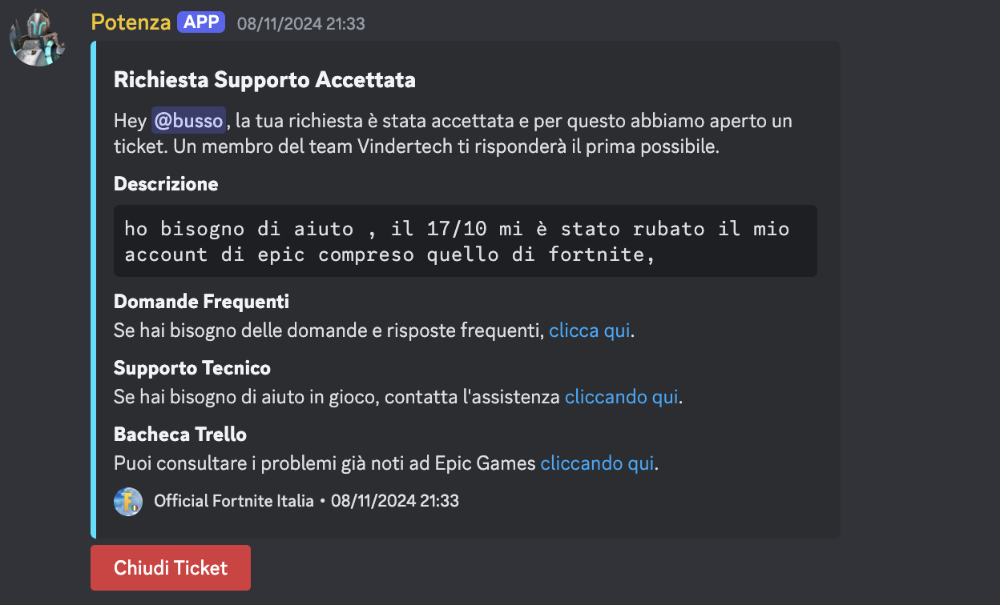
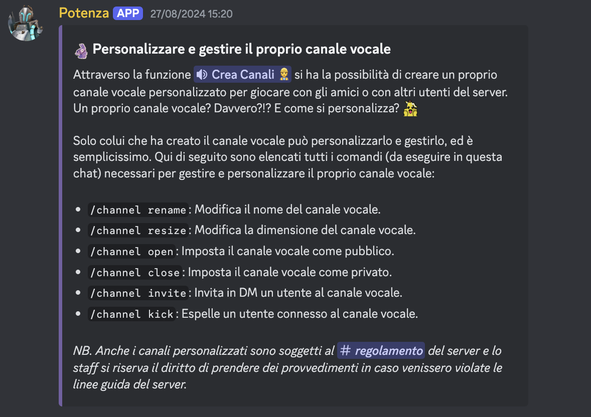

# Potenza

Discord bot for the Official Fortnite Italia server. It manages the support ticketing system and manages the custom voice channels feature.




## Run Locally

Clone the project

```bash
  git clone https://github.com/mettiuss/potenza.git
```

Go to the project directory

```bash
  cd potenza
```

Start the bot

```bash
  npm run test
```

## Authors

-   [@mettiuss](https://github.com/mettiuss)
-   [@mirkohubtv](https://github.com/mirkohubtv)
